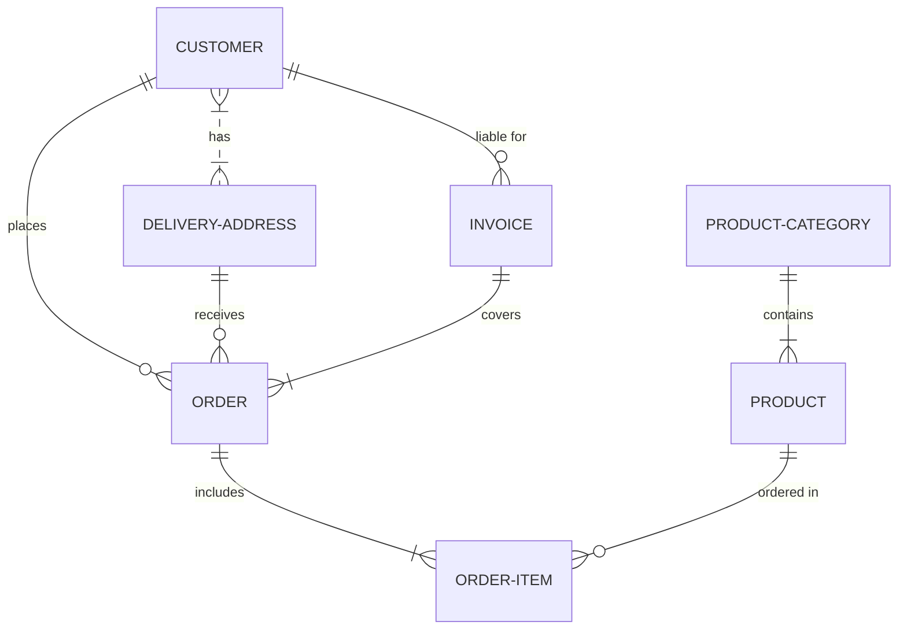

# Proyecto de Estudio!
    
**Estructura del documento principal:**
PROYECTO SOBRE LA GESTION DE OBRAS DEL Instituto Autárquico de Planeamiento y Vivienda (IAPV) de la provincia de Entre Ríos

**Asignatura**: Bases de Datos I (FaCENA-UNNE)

**Integrantes**:
Cabrera Romani Lucas Ivan
Brollo Celso, Raul
Barrientos Franco
Capay Gabriel

**Año**: 2024

## CAPÍTULO I: INTRODUCCIÓN

### Caso de estudio

Nuestro escenario se basa en un Instituto Autárquico de Planeamiento y Vivienda (IAPV) de la provincia de Entre Ríos, que se dedica a la construcción de unidades habitacionales por convenios o concesiones con empresas privadas. Dichas construcciones se pueden llevar a cabo en las distintas ciudades de la provincia. De los proyectos se desean saber cuál es el número de proyecto que se va a realizar en una ciudad y su departamento, el tipo de construcción que se va a realizar (viviendas amuebladas, viviendas techadas, calles asfaltadas, enripiado, etc.), el nombre del proyecto que se llevara a cabo, la fecha de inicio y fin estimada para el proyecto.

De la empresa que se encarga de la construcción, se desea saber el número de empresa, nombre de la empresa, dirección y ciudad, como también un representante técnico del cual se desea conocer el nombre, apellido, DNI y correo electrónico.

Una vez empezada la obra, por cada etapa que se va cumpliendo, un inspector del Instituto va a constatar la misma y autorizar con su aprobación la continuidad de dicha obra. Del inspector se desea conocer el nombre, apellido, DNI, correo electrónico y teléfono.

Se debe tener en cuenta que cada proyecto puede tener puede tener varias etapas distintas, y una misma etapa puede tener varias inspecciones. A su vez de cada inspección, se quiere saber el nombre de la etapa, el inspector que realizara dicha inspección, estado de la etapa y fecha en la que se realizó la inspección.

## CAPITULO II: MARCO CONCEPTUAL O REFERENCIAL
 (Marco teórico. Acá se debe explicar brevemente los conceptos sobre los temas técnicos de los motores de bases de datos que se asignó a cada grupo)

**TEMA 1 " ---- "** 

**TEMA 2 " ----- "** 

## CAPÍTULO III: METODOLOGÍA SEGUIDA 

 **a) Cómo se realizó el Trabajo Práctico**
en desarrollo
 **b) Herramientas (Instrumentos y procedimientos)**
1) ERD Plus: Es la herramienta con la que creamos y editamos los diagramas, permitiéndonos trabajar en equipo y en línea, facilitando también la forma de guardar y editar los cambios sobre los diagramas.

## CAPÍTULO IV: DESARROLLO DEL TEMA / PRESENTACIÓN DE RESULTADOS 

### Diagrama conceptual (opcional)

Ejemplo usando Live Editor https://mermaid.js.org/ (ejemplo opcional)

### Diagrama relacional

v

### Diccionario de datos

Acceso al documento [PDF](doc/diccionario_datos.pdf) del diccionario de datos.

### Desarrollo TEMA 1 "----"

Fusce auctor finibus lectus, in aliquam orci fermentum id. Fusce sagittis lacus ante, et sodales eros porta interdum. Donec sed lacus et eros condimentum posuere. 

> Acceder a la siguiente carpeta para la descripción completa del tema [scripts-> tema_1](script/tema01_nombre_tema)

### Desarrollo TEMA 2 "----"

Proin aliquet mauris id ex venenatis, eget fermentum lectus malesuada. Maecenas a purus arcu. Etiam pellentesque tempor dictum. 

> Acceder a la siguiente carpeta para la descripción completa del tema [scripts-> tema_2](script/tema02_nombre_tema)

... 

## CAPÍTULO V: CONCLUSIONES

Nunc sollicitudin purus quis ante sodales luctus. Proin a scelerisque libero, vitae pharetra lacus. Nunc finibus, tellus et dictum semper, nisi sem accumsan ligula, et euismod quam ex a tellus. 

## BIBLIOGRAFÍA DE CONSULTA

 1. List item
 2. List item
 3. List item
 4. List item
 5. List item

